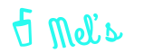
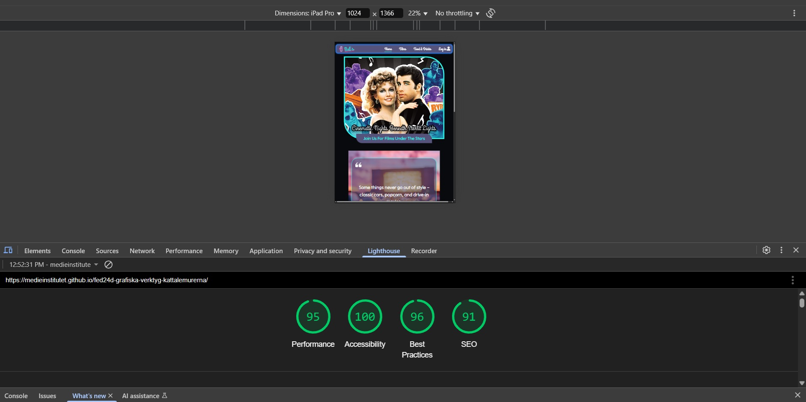
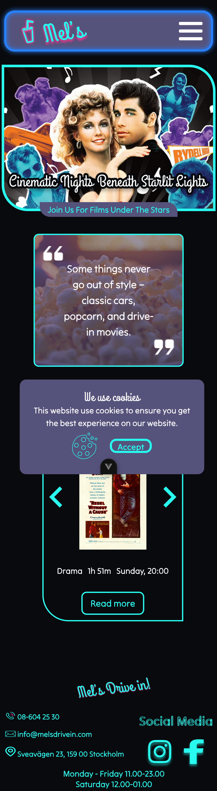
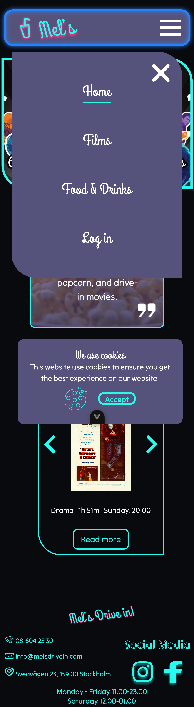
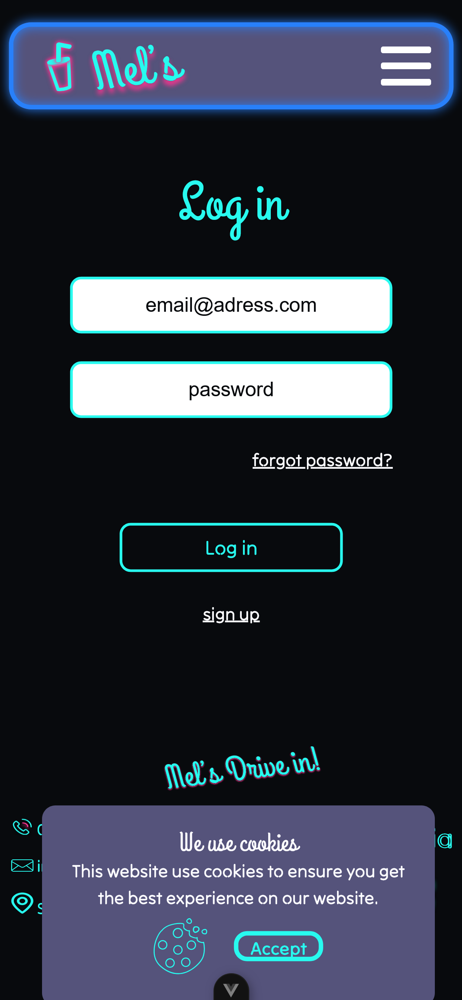
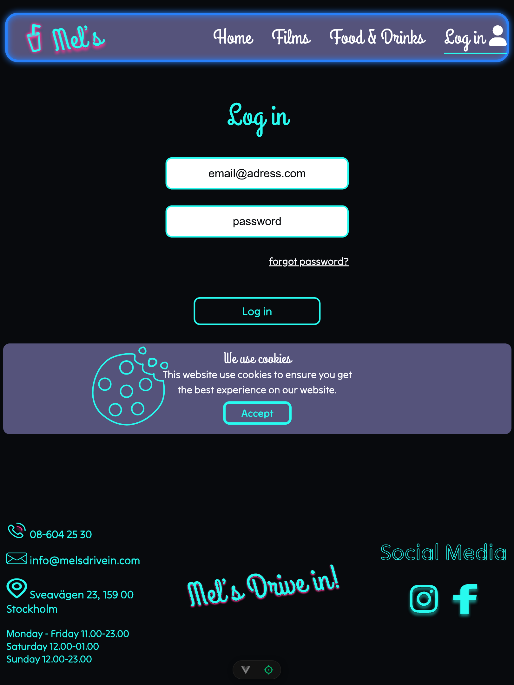
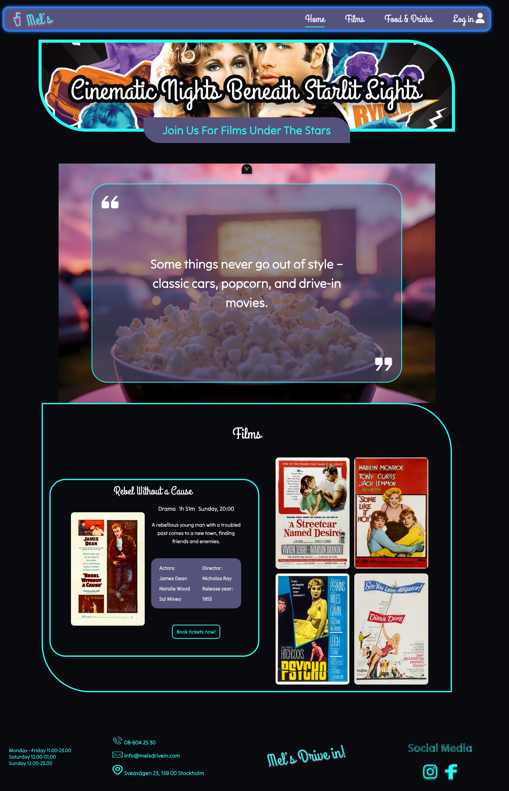
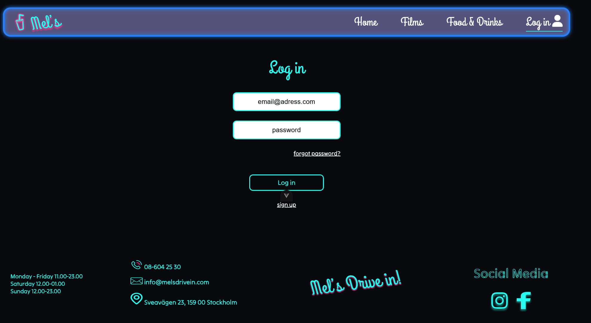
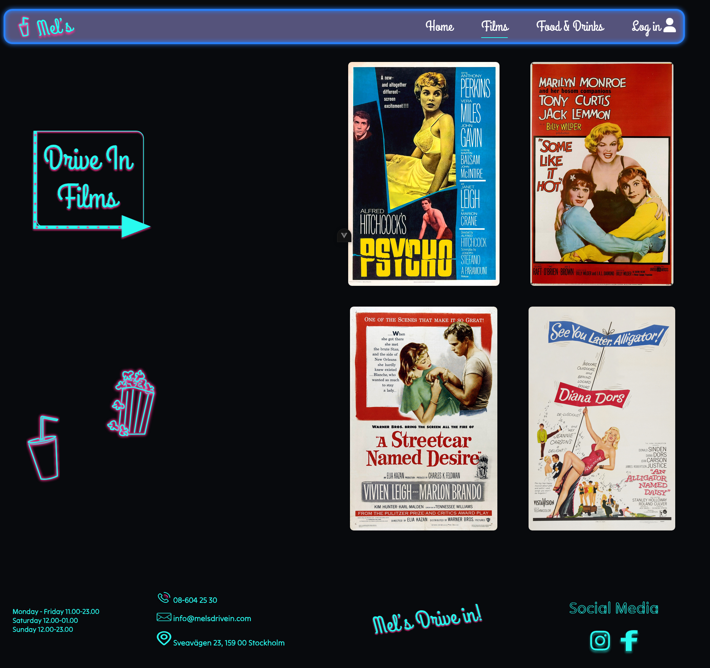

## Title and description

Mel's Drive-In is a web experience designed for movie lovers who enjoy watching films from their car. Inspired by the retro charm of classic drive-in theaters, our platform provides a seamless, user-friendly way to explore movies, navigate between pages, and access essential information.

🚗 Features
🏠 Home Page – A visually engaging landing page featuring:

- A carousel showcasing movies with descriptions.
- A navigation menu for smooth page transitions.
- A footer containing contact details and cookie policy information.

🎟️ Movie Page – A dedicated section displaying available movies with details.

🔐 Login Page – Secure authentication for users.

🎥 Get ready to experience movies like never before – from your car, under the stars!

## Technologies

The project is built with:


## Installation

Install project with npm

```
  npm install
```

To run tests, run the following command for Vite

```
  npm run dev
```

## Color Reference

| Our Reference         | Hex                                                              |
|--------------|------------------------------------------------------------------|
| aqua: |  #2880FA |
| neon-teal: |  #28FAEF |
| neon-pig: |  #FA3590 |
| midnight-sky: |  #55537B |
| mels-black: |  #080A0D |
| mels-white: |  #00d1a0 |

## Fonts Used

**Primary Font:** [Grand Hotel](https://fonts.google.com/specimen/Grand+Hotel?query=grand+hotel)
**Secondary Font:** [Tilt Neon](https://fonts.google.com/specimen/Tilt+Neon)
**Third Font:** [Roboto](https://fonts.google.com/specimen/Roboto)

## Logo




## Responsive design

Our project is fully responsive, ensuring a seamless experience across mobile, tablet, and desktop devices. We have carefully designed and implemented adaptive layouts to enhance usability and accessibility.

**Multi-Device Support:**
Optimized for mobile, tablet, and desktop resolutions.
**Adaptive Navigation:**
Mobile: Hamburger menu for a clean, minimal interface.
**Tablet & Desktop:**
A tab-based navigation bar for easy access between pages.
**Dynamic Header:**
Different headers based on screen size to improve user experience.
**Responsive Buttons:**
Buttons adjust in size and spacing to maintain usability on touch and click interactions.
**Flexible Grid & Layouts:**
Uses a fluid grid system to adapt to different screen sizes smoothly.

## Screenshots

Accessibility


Mobil





Tablet




Desktop




## Run Locally

Clone the project

```bash
  git clone https://github.com/Medieinstitutet/fed24d-grafiska-verktyg-kattalemurerna/tree/main
```

Go to the project directory

```bash
  cd my-project
```

Install dependencies

```bash
  npm install
```

Start the server

```bash
  npm run start
```

## Authors

https://github.com/LcNyaker
https://github.com/DulamaA
https://github.com/Biehlen/
https://github.com/koliwewe
https://github.com/YamanDev8

## About the design

Mel's drive-in loves neon and vintage cars, and is inspired by the 1950s. The design reflects this by the use of neon colours that lights up against the dark background. Fonts and buttons are inspired by the smooth curves of old neon signs.
